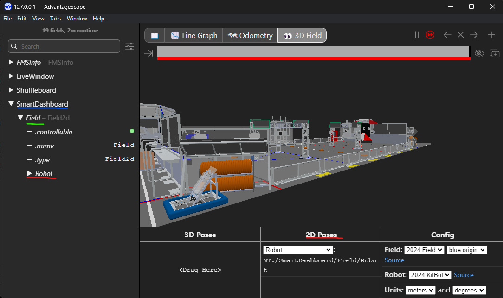

# Robot Simulation Example
Original example provided by the [CTRE Examples Repository](https://github.com/CrossTheRoadElec/Phoenix6-Examples/tree/main).
## Setup Instructions
### Prerequisites
You will need a copy of the latest [WIPLib](https://github.com/wpilibsuite/allwpilib/releases/latest) installed.\
You can follow the instructions listed here at the [Official WPILib Docs](https://docs.wpilib.org/en/stable/docs/zero-to-robot/step-2/wpilib-setup.html).\
\
Don't forget to install the [FRC Game Tools](https://www.ni.com/en/support/downloads/drivers/download.frc-game-tools.html#500107).\
You can follow the instructions to install this listed here at the [Official WPILib Docs](https://docs.wpilib.org/en/stable/docs/zero-to-robot/step-2/frc-game-tools.html).\
\
Make sure you have an XBox (or something similar) controller on hand for the simulation.
### Download & Open the Project
- Clone this repository by clicking the blue Code button above the file listing.
- Extract the zip into a good place, the Downloads folder will suffice.
  - Make sure that the file structure is akin to this:
    - Downloads
    - ├─ Your extracted ZIP
    - │  ├─ Project files.
- Open WPILib VS Code.
- Click 'Open Folder' from the start page.
- Choose your Extracted ZIP folder from earlier.
<!-- -->
Your screen should look alike to the screenshot below.\
Don't worry about most of the icons on the bottom and to the left, it's just apart of my custom setup and won't affect anything for you.\

### Start the Simulation
- Click the three dots in the top right.
- Click the ```Simulate Robot Code``` from the dropdown menu as shown below.
<!-- -->

- Make sure to select DriverStation only when the prompt appears between the Sim GUI and DriverStation.\

- Open FRC Driver Station, searching on the taskbar should suffice.
  - If you haven't yet, set the team number to your team.
  - 
### Setup Advantage Scope
At this point you should have the sim running in VS Code, and the Driver Station open.\
Next is AdvantageScope.
<!---->
- Open AdvantageScope. This can be found on your desktop in the ```*Year* WPILib Tools``` folder on your Desktop.
  - You can also open it via the WPILib command palette -> Start Tool task.
- Connect AdvantageScope to your sim session via the File dropdown shown below.
<!--Good job making it this far if it's your first time. This seems like a lot but you'll get used to it!-->

- It should connect with no problems.
- After that click the Tabs dropdown, click the New Tab expander, and add an Odometry tab, and a 3D Field tab.
  - Odometry is a 2D Field that shows and tracks your robot's moves.
- Your window should like like the screenshot below.
  - Don't forget to change the Radians to Degrees, as field2d is in degrees.
<!---->

- Drag the Robot object into the 2D Poses slot.
- After that it should show the robots position of the field like the screenshot below.
<!---->

- Plug in your controller.
- Driver Station should stop complaining about missing a joystick, and the sim should be controllable via the joysticks now.
### Results
The simulation should be functional now, perfect for testing!\
